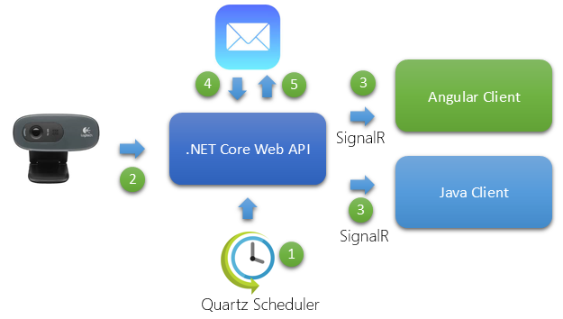
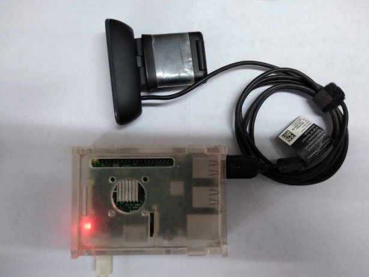
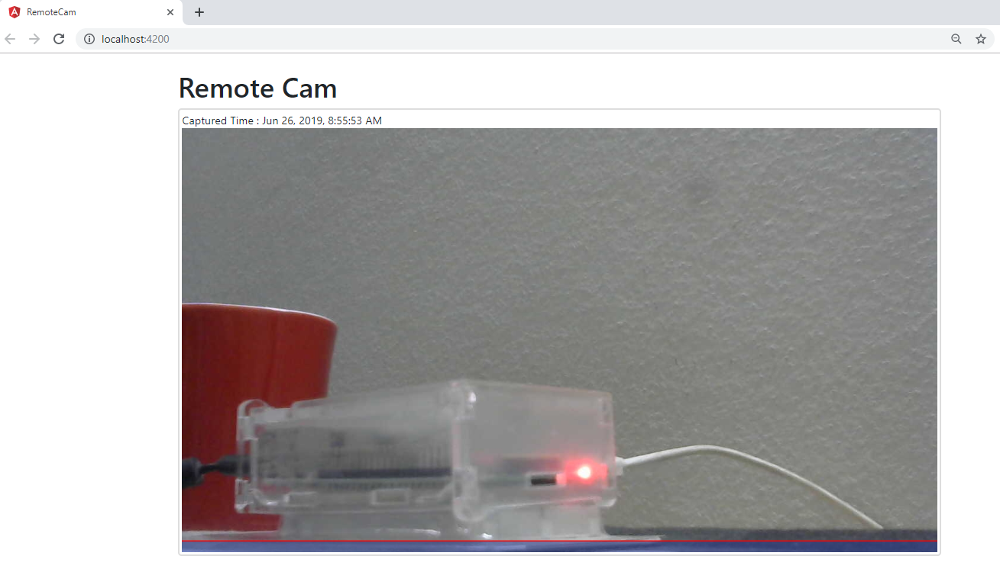
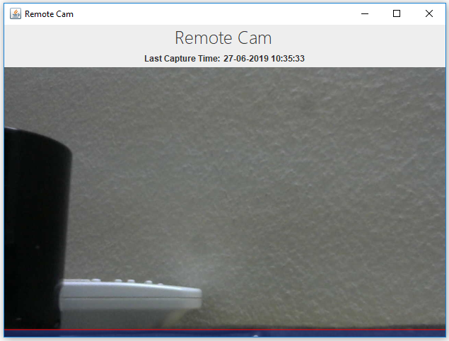
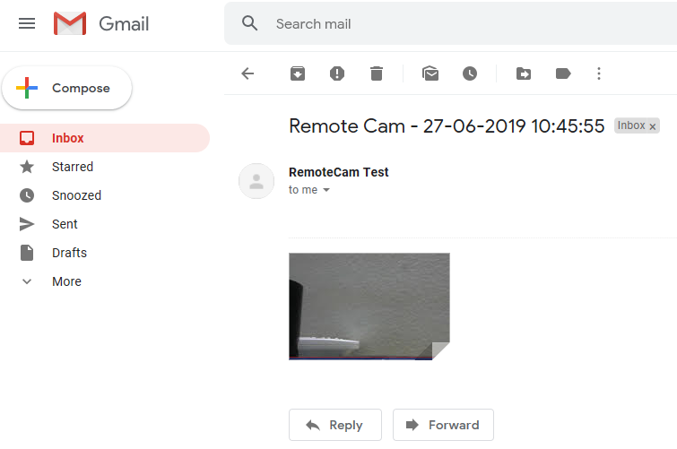

# Remote Cam

To capture a remote location, using a camera connected to an IOT device (Raspberry Pi) in near real time.

## Introduction

  

The solution contains different modules, which will be better suitalble for different purposes.

1. The .NET core based Web API solution has a Quartz based scheduler, which will capture the image for every say 5 seconds.
1. After capturing the image, the job will send a real time notification using SignalR.
1. If we are interested in a web based client, we have an Angular based client, which will show the captured image.
1. If we would like to have a desktop client, we have a Java based cross platform client to show the captured image.
1. These tools are sufficient if we are connected to a IOT device with public IP address. If the device is in a local network without having a global IP address, to send the captured image, it will listen for a message in inbox and reply to the sender with capture as an attachment.
   
## Hardware

  
 
Below hardware is used in this solution:

1. Raspberry Pi - 1No
2. USB Camera - 1No

## Software

The software consists of three parts:

1. Capturing server with Quartz scheduler - Implemented in **C# .NET Core - Web API**
2. Web Client - Implemented in **Angular-8**
3. Cross Platform Desktop Client - Implemented in **Java Swing**

### Angular Web Client

*Angular-8 based web client* 

### Java Desktop Client

*Java based cross platform desktop client* 

### Email Response

*If we request RemoteCam by sending an email, it will responsd with the remote capture.* 

PS: Please get credentials using <a href='https://developers.google.com/gmail/api/' target='_blank'>Gmail API</a>.

